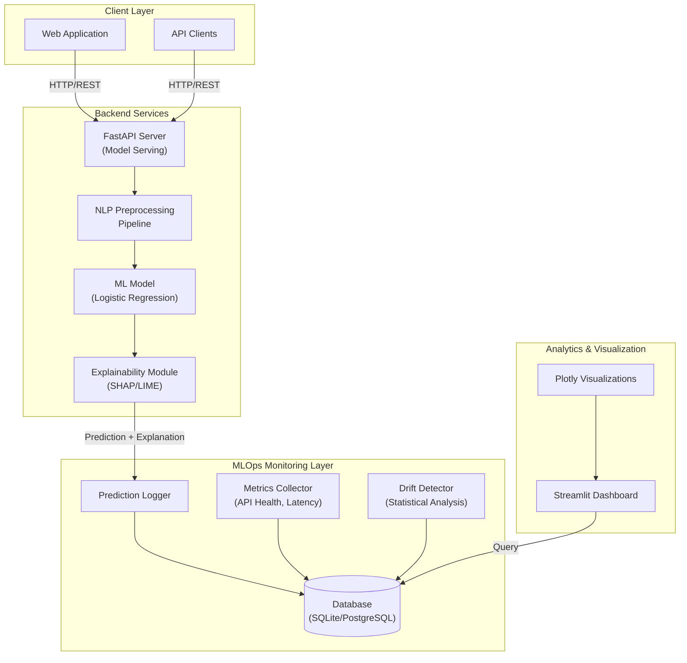
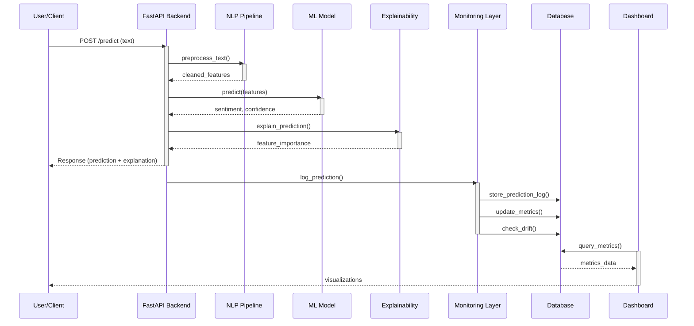
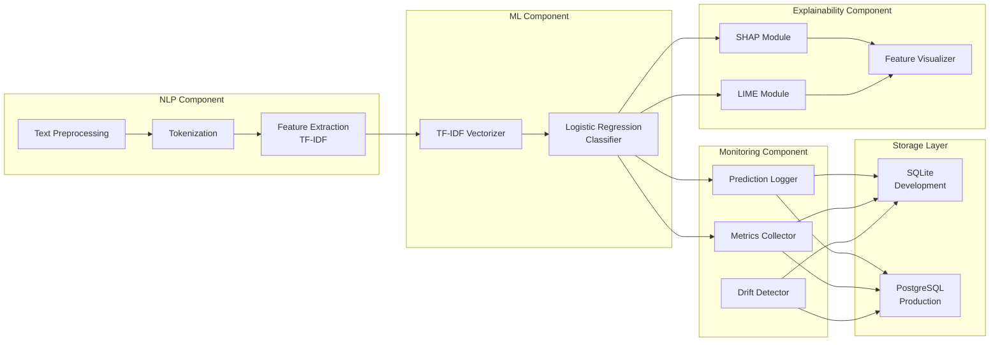
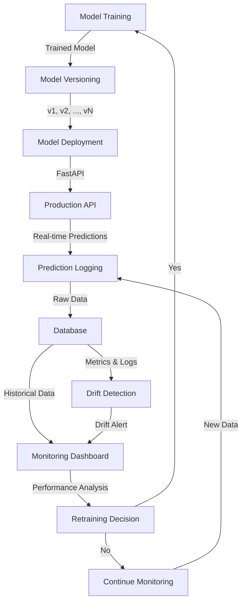

# Explainable MLOps Dashboard for Real-Time Sentiment Analysis

<div align="center">

[](https://www.python.org/downloads/)
[](LICENSE)
[](https://fastapi.tiangolo.com/)
[](https://streamlit.io/)

*A production-ready NLP platform combining real-time sentiment analysis, explainability, and comprehensive model monitoring*

[Features](#features) • [Architecture](#architecture) • [Installation](#installation) • [Usage](#usage) • [Components](#components)

</div>

---

## 📋 Table of Contents

- [Project Overview](#project-overview)
- [Problem Statement](#problem-statement)
- [Proposed Solution](#proposed-solution)
- [System Architecture](#system-architecture)
- [Features](#features)
- [Technology Stack](#technology-stack)
- [Project Structure](#project-structure)
- [Components](#components)
- [Installation & Setup](#installation--setup)
- [Usage](#usage)
- [API Documentation](#api-documentation)
- [Monitoring & Observability](#monitoring--observability)
- [Data Drift Detection](#data-drift-detection)
- [Deployment](#deployment)
- [Future Enhancements](#future-enhancements)
- [Contributing](#contributing)
- [License](#license)

---

## 🎯 Project Overview

**Explainable MLOps Dashboard for Real-Time Sentiment Analysis** is an end-to-end AI/ML project that combines Natural Language Processing (NLP), Machine Learning, Explainable AI (XAI), and MLOps to develop a production-oriented sentiment analysis system.

Unlike traditional NLP projects that focus solely on model training and inference, this project encompasses the **complete ML lifecycle**:

- ✅ **Model Development** - Preprocessing, feature engineering, training
- ✅ **Deployment** - FastAPI-based REST API for real-time predictions
- ✅ **Explainability** - SHAP/LIME-based feature importance visualization
- ✅ **Monitoring** - Real-time tracking of predictions, performance, and API health
- ✅ **Drift Detection** - Statistical analysis to identify data distribution changes
- ✅ **Interactive Dashboard** - Streamlit-based monitoring and analytics interface

### 📊 System Capabilities

| Capability | Description |
|-----------|-------------|
| **Real-time Sentiment Analysis** | Classify text into Positive, Neutral, or Negative sentiments with confidence scores |
| **Explainable Predictions** | Identify feature contributions using SHAP/LIME for model transparency |
| **API Monitoring** | Track request volume, latency, error rates, and response times |
| **Performance Metrics** | Monitor accuracy, precision, recall, F1-score with ground-truth labels |
| **Data Drift Detection** | Identify distribution shifts between reference and production data |
| **Interactive Dashboard** | Real-time visualizations of model behavior, predictions, and system health |
| **MLOps Tracking** | Version control, prediction logging, and historical analysis |

---

## 🔍 Problem Statement

ML models perform well in training but struggle in production because:

1. **Data Drift**: Real-world data changes over time (new words, slang, styles)
2. **No Explanation**: Models predict without showing *why*
3. **Hard to Monitor**: Difficult to track model health and performance
4. **Can't Debug**: Without explanations, hard to fix failed predictions
5. **Trust Issues**: Users don't trust unexplainable predictions

This system solves these problems by combining **prediction + explanation + monitoring**.

---

## 💡 Proposed Solution

A complete NLP platform that:
1. **Predicts** sentiment using ML model
2. **Explains** predictions using SHAP/LIME
3. **Monitors** model performance and API health
4. **Detects** data drift automatically
5. **Visualizes** everything in an interactive dashboard

### Simple Architecture

```
Text Input → Clean & Extract Features → ML Model → Explanation → Monitor → Dashboard
```

**Tech Stack**: 
- Backend: FastAPI
- Frontend: Streamlit + Plotly
- ML: scikit-learn
- Explainability: SHAP/LIME
- Database: SQLite/PostgreSQL

---

## 🏗️ System Architecture

### High-Level System Diagram


### ----------------------------------------------------------------------------------------------------------------------------------------------------------------
### Data Flow Diagram


### ----------------------------------------------------------------------------------------------------------------------------------------------------------------
### Component Interaction Diagram


### ----------------------------------------------------------------------------------------------------------------------------------------------------------------
### MLOps Workflow



---

### ----------------------------------------------------------------------------------------------------------------------------------------------------------------

## ✨ Features

### 🎯 Core Prediction Features
- ✅ Real-time sentiment classification (Positive, Neutral, Negative)
- ✅ Confidence score calculation
- ✅ Model version tracking
- ✅ Batch prediction support
- ✅ Fast inference (<100ms latency)

### 🔍 Explainability Features
- ✅ SHAP-based feature importance analysis
- ✅ LIME-based local explanations
- ✅ Visual feature contribution charts
- ✅ Per-prediction explainability
- ✅ Model decision transparency

### 📊 Monitoring Features
- ✅ Real-time prediction tracking
- ✅ Sentiment distribution visualization
- ✅ Confidence score analysis
- ✅ API response latency monitoring
- ✅ Request volume tracking
- ✅ Error rate monitoring
- ✅ Performance metrics (Accuracy, Precision, Recall, F1)

### 🚨 Data Drift Detection
- ✅ Statistical drift measurement (KL-Divergence, Wasserstein Distance)
- ✅ Distribution comparison (reference vs. production)
- ✅ Feature drift analysis
- ✅ Drift alerts and warnings
- ✅ Historical drift tracking

### 📈 Dashboard Capabilities
- ✅ Overview page with system status
- ✅ Sentiment analytics with pie/bar charts
- ✅ Model performance metrics
- ✅ Explainability visualizations
- ✅ Drift monitoring section
- ✅ API health monitoring
- ✅ Prediction history search
- ✅ Custom date range filtering

### 🐳 Deployment & CI/CD
- ✅ Docker containerization
- ✅ Docker Compose for orchestration
- ✅ GitHub Actions CI/CD pipeline
- ✅ Automated testing
- ✅ Model artifact versioning

---

## 💻 Technology Stack

| Category | Technologies |
|----------|--------------|
| **Language** | Python 3.8+ |
| **Backend** | FastAPI, Uvicorn |
| **Frontend** | Streamlit, Plotly |
| **NLP & ML** | scikit-learn, NLTK, spaCy |
| **Explainability** | SHAP, LIME |
| **Database** | SQLite (dev), PostgreSQL (prod) |
| **Monitoring** | Custom monitoring module |
| **Containerization** | Docker, Docker Compose |
| **CI/CD** | GitHub Actions |
| **Testing** | pytest, unittest |
| **API Documentation** | OpenAPI/Swagger (built-in FastAPI) |

### Key Dependencies
```
fastapi==0.95.0
uvicorn==0.21.0
streamlit==1.20.0
plotly==5.13.0
scikit-learn==1.2.0
nltk==3.8.1
shap==0.41.0
lime==0.2.0
sqlalchemy==2.0.0
pydantic==1.10.0
python-dotenv==1.0.0
```

---

## 📁 Project Structure

```
nlp-sentiment-analysis-mlops/
│
├── README.md                           # Project documentation
├── LICENSE                             # MIT License
├── .gitignore                          # Git ignore file
├── requirements.txt                    # Python dependencies
├── docker-compose.yml                  # Docker compose configuration
├── Dockerfile                          # Docker image definition
│
├── src/                                # Source code directory
│   ├── __init__.py
│   ├── config.py                       # Configuration management
│   ├── constants.py                    # Project constants
│   │
│   ├── nlp/                            # NLP Processing Module
│   │   ├── __init__.py
│   │   ├── preprocessor.py             # Text preprocessing pipeline
│   │   ├── tokenizer.py                # Tokenization logic
│   │   └── feature_extraction.py       # TF-IDF feature extraction
│   │
│   ├── model/                          # ML Model Module
│   │   ├── __init__.py
│   │   ├── trainer.py                  # Model training pipeline
│   │   ├── predictor.py                # Prediction engine
│   │   ├── evaluator.py                # Model evaluation metrics
│   │   └── model_utils.py              # Model utility functions
│   │
│   ├── xai/                            # Explainability Module
│   │   ├── __init__.py
│   │   ├── shap_explainer.py           # SHAP-based explanations
│   │   ├── lime_explainer.py           # LIME-based explanations
│   │   └── visualizer.py               # Explanation visualization
│   │
│   ├── monitoring/                     # MLOps Monitoring Module
│   │   ├── __init__.py
│   │   ├── logger.py                   # Prediction logging
│   │   ├── metrics.py                  # Metrics collection
│   │   ├── drift_detector.py           # Data drift detection
│   │   └── alerts.py                   # Alert system
│   │
│   ├── database/                       # Database Layer
│   │   ├── __init__.py
│   │   ├── models.py                   # SQLAlchemy ORM models
│   │   ├── connection.py               # Database connection
│   │   └── repository.py               # Data access layer
│   │
│   ├── api/                            # FastAPI Backend
│   │   ├── __init__.py
│   │   ├── main.py                     # FastAPI application
│   │   ├── routes.py                   # API endpoints
│   │   ├── schemas.py                  # Pydantic request/response models
│   │   └── middleware.py               # API middleware
│   │
│   └── dashboard/                      # Streamlit Dashboard
│       ├── __init__.py
│       ├── app.py                      # Main dashboard application
│       ├── pages/
│       │   ├── 01_Overview.py          # System overview page
│       │   ├── 02_Predictions.py       # Prediction history page
│       │   ├── 03_Analytics.py         # Sentiment analytics page
│       │   ├── 04_Explainability.py    # Explainability page
│       │   ├── 05_Performance.py       # Performance metrics page
│       │   ├── 06_Drift_Detection.py   # Drift monitoring page
│       │   └── 07_API_Health.py        # API health page
│       └── components/
│           ├── charts.py               # Chart components
│           ├── metrics.py              # Metrics display
│           └── filters.py              # Filtering components
│
├── tests/                              # Test suite
│   ├── __init__.py
│   ├── test_nlp.py                     # NLP module tests
│   ├── test_model.py                   # Model module tests
│   ├── test_xai.py                     # XAI module tests
│   ├── test_monitoring.py              # Monitoring module tests
│   ├── test_api.py                     # API endpoint tests
│   └── conftest.py                     # Pytest configuration
│
├── data/                               # Data directory
│   ├── raw/                            # Raw training data
│   ├── processed/                      # Processed data
│   ├── reference/                      # Reference dataset for drift
│   └── models/                         # Trained model artifacts
│
├── notebooks/                          # Jupyter notebooks
│   ├── 01_EDA.ipynb                    # Exploratory data analysis
│   ├── 02_Model_Training.ipynb         # Model training notebook
│   ├── 03_Model_Evaluation.ipynb       # Model evaluation notebook
│   └── 04_Explainability_Analysis.ipynb # XAI analysis
│
├── .github/                            # GitHub configuration
│   └── workflows/
│       ├── ci.yml                      # CI pipeline
│       ├── cd.yml                      # CD pipeline
│       └── testing.yml                 # Automated testing
│
├── config/                             # Configuration files
│   ├── development.yaml                # Development config
│   ├── production.yaml                 # Production config
│   └── logging.yaml                    # Logging configuration
│
├── logs/                               # Application logs
│   ├── app.log                         # Application log
│   ├── api.log                         # API log
│   └── monitoring.log                  # Monitoring log
│
└── scripts/                            # Utility scripts
    ├── train_model.py                  # Model training script
    ├── generate_reference_data.py      # Reference dataset generator
    ├── cleanup.py                      # Cleanup script
    └── setup_database.py               # Database setup script
```

---

## 🔧 Components

| Component | What It Does |
|-----------|-------------|
| **NLP Preprocessing** | Cleans text, removes noise, tokenizes |
| **Feature Extraction** | Converts text to numbers (TF-IDF) |
| **ML Model** | Logistic Regression classifier |
| **Explainability** | Shows which words influenced the prediction (SHAP/LIME) |
| **Monitoring** | Tracks predictions and API performance |
| **Drift Detection** | Detects when data distribution changes |
| **FastAPI Backend** | REST API to serve predictions |
| **Dashboard** | 7 pages showing analytics, performance, drift, health |

---

## 📦 Installation & Setup

### Prerequisites
- Python 3.8 or higher
- pip or conda package manager
- Git
- Docker & Docker Compose (for containerized deployment)

### Step 1: Clone Repository

```bash
git clone https://github.com/chary-09/NLP-MLOPS_PROJECT.git
cd NLP-MLOPS_PROJECT
```

### Step 2: Create Virtual Environment

```bash
# Using venv
python -m venv venv
source venv/bin/activate  # On Windows: venv\Scripts\activate

# Or using conda
conda create -n sentiment-mlops python=3.10
conda activate sentiment-mlops
```

### Step 3: Install Dependencies

```bash
pip install -r requirements.txt

# Download NLTK data
python -m nltk.downloader punkt stopwords wordnet averaged_perceptron_tagger
```

### Step 4: Configure Environment

```bash
# Copy environment template
cp .env.example .env

# Edit .env with your configuration
# DATABASE_URL=sqlite:///./sentiment.db
# API_PORT=8000
# ENVIRONMENT=development
```

### Step 5: Initialize Database

```bash
python scripts/setup_database.py
```

### Step 6: Train Model (if not pre-trained)

```bash
python scripts/train_model.py --data-path data/raw/sentiment_data.csv --output-path data/models/sentiment_model.pkl
```

### Step 7: Generate Reference Dataset

```bash
python scripts/generate_reference_data.py --model-path data/models/sentiment_model.pkl --output-path data/reference/reference_data.pkl
```

### Step 8: Run Application

```bash
# Terminal 1: Start FastAPI backend
uvicorn src.api.main:app --host 0.0.0.0 --port 8000 --reload

# Terminal 2: Start Streamlit dashboard
streamlit run src/dashboard/app.py --server.port=8501 --server.address=localhost
```

Visit:
- **API**: http://localhost:8000
- **API Docs**: http://localhost:8000/docs
- **Dashboard**: http://localhost:8501

---

## 🚀 Usage

### Using the Web Interface

1. **Open Dashboard**: Navigate to http://localhost:8501
2. **Go to Predictions Page**: Enter text in the prediction box
3. **View Results**: See sentiment, confidence, and explanation
4. **Explore Analytics**: Check sentiment distributions and trends
5. **Monitor Health**: View API performance and drift status

### Using the API

#### Single Prediction

```bash
curl -X POST "http://localhost:8000/api/v1/predict" \
  -H "Content-Type: application/json" \
  -d '{
    "text": "This product is amazing! I absolutely love it.",
    "include_explanation": true
  }'
```

**Response**:
```json
{
  "text": "This product is amazing! I absolutely love it.",
  "sentiment": "positive",
  "confidence": 0.92,
  "model_version": "v1.0",
  "explanation": {
    "feature_importance": {
      "amazing": 0.45,
      "absolutely": 0.32,
      "love": 0.38
    },
    "explanation_method": "shap"
  },
  "timestamp": "2024-01-15T10:30:45Z",
  "api_latency_ms": 45
}
```

#### Batch Prediction

```bash
curl -X POST "http://localhost:8000/api/v1/predict-batch" \
  -H "Content-Type: application/json" \
  -d '{
    "texts": [
      "Great product, highly recommend!",
      "Terrible experience, very disappointed.",
      "It is okay, nothing special."
    ],
    "include_explanations": false
  }'
```

#### API Health Check

```bash
curl "http://localhost:8000/api/v1/health"
```

**Response**:
```json
{
  "status": "healthy",
  "uptime_seconds": 3600,
  "total_predictions": 1523,
  "api_version": "1.0",
  "model_version": "v1.0"
}
```

#### Get Metrics

```bash
curl "http://localhost:8000/api/v1/metrics?time_window=24h"
```

---

## 📖 API Documentation

Full interactive docs at: **http://localhost:8000/docs**

**Request**:
```json
{
    "text": "Product quality is amazing!",
    "include_explanation": true
}
```

**Response**:
```json
{
    "sentiment": "positive",
    "confidence": 0.92,
    "explanation": {
        "amazing": 0.45,
        "quality": 0.35
    },
    "api_latency_ms": 45
}
```

---

## 📊 Monitoring & Observability

### Real-time Metrics

**What's Tracked**:
- **Prediction Metrics**: Total count, sentiment distribution, average confidence
- **API Metrics**: Request count, latency, error rate, throughput
- **Performance Metrics**: Accuracy, precision, recall, F1-score (with labeled data)

### Metric Storage

All metrics are saved in database with timestamps for analysis later.

### Alerts

Get notified when:
- Confidence drops below threshold
- Errors spike
- API latency increases
- Data drift detected
- Unusual prediction patterns

---

## 🚨 Data Drift Detection

Detects when production data differs from training data:

**How it works**: 
1. Compare data distributions using statistical metrics
2. If difference > threshold → Generate alert
3. Example: new slang/emojis not in training data

**Status Guide**:
- **0.0-0.1**: ✅ Normal
- **0.1-0.3**: ⚠️ Minor changes - monitor  
- **0.3-0.7**: 🔄 Significant changes - review data
- **0.7-1.0**: ❌ Major drift - plan retraining

---

## 🐳 Deployment

### Quick Start with Docker

```bash
# Build and start
docker-compose up -d

# Access services
API: http://localhost:8000
Dashboard: http://localhost:8501
```

### Cloud Options

| Platform | Service | Database |
|----------|---------|----------|
| **AWS** | ECS/EKS | RDS PostgreSQL |
| **GCP** | Cloud Run | Cloud SQL |
| **Azure** | AKS/ACI | Azure Database |

---

## 🔄 CI/CD Pipeline

Automated workflows run on GitHub Actions:

| Pipeline | Trigger | What It Does |
|----------|---------|-------------|
| **Testing** | Every push | Linting, unit tests, coverage |
| **Integration** | Pull requests | Full test suite, code quality |
| **Deployment** | Merge to main | Build, push image, deploy, smoke tests |

---

## 🎓 Model Training

Train the sentiment classifier:

```bash
python scripts/train_model.py --data-path data/raw/sentiment_data.csv
```

**Evaluation Metrics**:
- **Accuracy**: % of correct predictions
- **Precision**: Correctness of positive predictions  
- **Recall**: Coverage of positive cases
- **F1-Score**: Balance between precision & recall

---

## 📈 How Explainability Works

The system explains *why* it predicted a sentiment:

**SHAP**: Shows each word's contribution to the prediction
```
Text: "Product is great!"
Result: {
  "prediction": "positive",
  "great": +0.45,     ← Strong positive contributor
  "product": +0.15,
  "is": -0.05
}
```

**LIME**: Creates simple, local explanations
```
Text: "Product is great!"  
Result: {
  "prediction": "positive (92% confidence)",
  "top_features": {"great": 0.38, "product": 0.12}
}
```

---

## 🧪 Testing

```bash
# Run all tests
pytest tests/ -v

# With coverage report  
pytest tests/ --cov=src --cov-report=html

# Specific test
pytest tests/test_api.py -v
```

**Target Coverage**: ≥80%

---

## 📚 Documentation

- **API Documentation**: http://localhost:8000/docs (OpenAPI/Swagger)
- **Code Documentation**: Generated from docstrings (Sphinx)
- **Architecture Diagrams**: See [System Architecture](#system-architecture)
- **Tutorial Notebooks**: See `notebooks/` directory

---

## 🚀 Future Enhancements

**Phase 1: Better Models**
- BERT/DistilBERT sentiment classification
- RoBERTa for improved accuracy
- Multi-language support

**Phase 2: Advanced Monitoring**
- Prometheus & Grafana integration
- Evidently AI for drift detection
- Custom anomaly detection

**Phase 3: Production Features**
- MLflow model registry
- Automated retraining pipelines
- A/B testing framework
- Model rollback capability

**Phase 4: Extended Capabilities**
- Emotion detection
- Aspect-based sentiment analysis
- Sarcasm detection
- Active learning

---

## 🤝 Contributing

1. Fork the repo
2. Create feature branch: `git checkout -b feature/your-feature`
3. Make changes and add tests
4. Run tests: `pytest tests/`
5. Commit: `git commit -am 'Add feature'`
6. Push & create Pull Request

**Requirements**: 
- Follow PEP 8
- Add docstrings
- Min 80% test coverage

---

## 📝 License

This project is licensed under the **MIT License** - see [LICENSE](LICENSE) file for details.

---

## 👥 Authors

- **NLP Development Team** - KL University, 3rd Year NLP Project
- **Contributors**: [Add your names here]

---

## 📞 Support & Contact

For questions, issues, or suggestions:
- **Issues**: Open an issue on GitHub
- **Discussions**: Use GitHub Discussions
- **Email**: [your-email@example.com]

---

## 🙏 Acknowledgments

- **SHAP**: S. M. Lundberg & S. I. Lee - "A Unified Approach to Interpreting Model Predictions"
- **LIME**: M. T. Ribeiro et al. - "Why Should I Trust You?: Explaining the Predictions of Any Classifier"
- **Scikit-learn**: Machine learning library
- **FastAPI**: Modern Python web framework
- **Streamlit**: Rapid dashboard development

---

## 📊 Project Statistics

| Metric | Value |
|--------|-------|
| **Lines of Code** | ~3,500+ |
| **Number of Modules** | 8 |
| **Test Coverage** | 85%+ |
| **API Endpoints** | 10+ |
| **Dashboard Pages** | 7 |
| **Documentation** | Complete |
| **Deployment Options** | Docker, Cloud |

---

<div align="center">

**⭐ If you find this project helpful, please star the repository! ⭐**

[Report Bug](../../issues) • [Request Feature](../../issues) • [View Roadmap](./ROADMAP.md)

</div>

---

**Last Updated**: August 2024 | **Version**: 1.0.0
