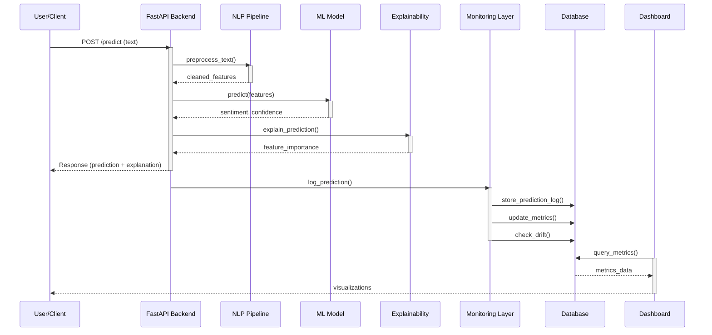
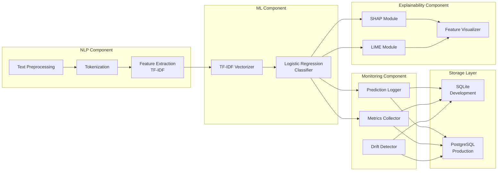
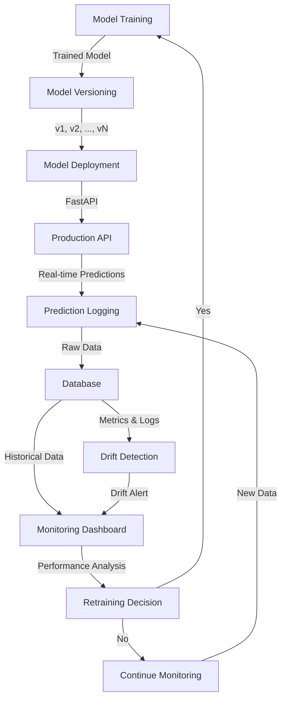

# Explainable MLOps Dashboard for Real-Time Sentiment Analysis

<div align="center">

[](https://www.python.org/downloads/)
[](LICENSE)
[](https://fastapi.tiangolo.com/)
[](https://streamlit.io/)

*A production-ready NLP platform combining real-time sentiment analysis, explainability, and comprehensive model monitoring*

[Features](#features) • [Architecture](#architecture) • [Installation](#installation) • [Usage](#usage) • [Components](#components)

</div>

---

## 📋 Table of Contents

- [Project Overview](#project-overview)
- [Problem Statement](#problem-statement)
- [Proposed Solution](#proposed-solution)
- [System Architecture](#system-architecture)
- [Features](#features)
- [Technology Stack](#technology-stack)
- [Project Structure](#project-structure)
- [Components](#components)
- [Installation & Setup](#installation--setup)
- [Usage](#usage)
- [API Documentation](#api-documentation)
- [Monitoring & Observability](#monitoring--observability)
- [Data Drift Detection](#data-drift-detection)
- [Deployment](#deployment)
- [Future Enhancements](#future-enhancements)
- [Contributing](#contributing)
- [License](#license)

---

## 🎯 Project Overview

**Explainable MLOps Dashboard for Real-Time Sentiment Analysis** is an end-to-end AI/ML project that combines Natural Language Processing (NLP), Machine Learning, Explainable AI (XAI), and MLOps to develop a production-oriented sentiment analysis system.

Unlike traditional NLP projects that focus solely on model training and inference, this project encompasses the **complete ML lifecycle**:

- ✅ **Model Development** - Preprocessing, feature engineering, training
- ✅ **Deployment** - FastAPI-based REST API for real-time predictions
- ✅ **Explainability** - SHAP/LIME-based feature importance visualization
- ✅ **Monitoring** - Real-time tracking of predictions, performance, and API health
- ✅ **Drift Detection** - Statistical analysis to identify data distribution changes
- ✅ **Interactive Dashboard** - Streamlit-based monitoring and analytics interface

### 📊 System Capabilities

| Capability | Description |
|-----------|-------------|
| **Real-time Sentiment Analysis** | Classify text into Positive, Neutral, or Negative sentiments with confidence scores |
| **Explainable Predictions** | Identify feature contributions using SHAP/LIME for model transparency |
| **API Monitoring** | Track request volume, latency, error rates, and response times |
| **Performance Metrics** | Monitor accuracy, precision, recall, F1-score with ground-truth labels |
| **Data Drift Detection** | Identify distribution shifts between reference and production data |
| **Interactive Dashboard** | Real-time visualizations of model behavior, predictions, and system health |
| **MLOps Tracking** | Version control, prediction logging, and historical analysis |

---

## 🔍 Problem Statement

Machine learning models often exhibit **performance degradation in production** due to several challenges:

1. **Data Drift**: Real-world data continuously evolves with new words, slang, writing styles, and topics not present in training data
2. **Model Opacity**: Traditional models return predictions without explaining the reasoning behind decisions
3. **Lack of Observability**: Difficult to understand model behavior, performance changes, and system health after deployment
4. **No Real-time Monitoring**: Challenges in detecting anomalies, errors, and performance issues in real-time
5. **Difficult Debugging**: Lack of explainability makes it hard to debug failed predictions and improve models

These challenges make it difficult for developers to:
- Trust the model's decisions
- Identify when retraining is necessary
- Debug model failures
- Maintain system reliability
- Comply with regulatory requirements for explainability

---

## 💡 Proposed Solution

The solution is an **integrated, production-ready NLP platform** that combines:

### Architecture Pillars

```
┌─────────────────────────────────────────────────────────┐
│         EXPLAINABLE MLOPS SENTIMENT SYSTEM              │
├─────────────────────────────────────────────────────────┤
│                                                         │
│  ┌──────────────┐  ┌──────────────┐  ┌─────────────┐  │
│  │     NLP      │  │   ML MODEL   │  │ EXPLAINABILITY│  │
│  │ Preprocessing│→ │ Prediction   │→ │ (SHAP/LIME) │  │
│  └──────────────┘  └──────────────┘  └─────────────┘  │
│          ↓                                      ↓        │
│  ┌──────────────────────────────────────────────────┐  │
│  │          MLOps Monitoring Layer                   │  │
│  │  • Prediction Logging  • Performance Metrics     │  │
│  │  • API Monitoring      • Data Drift Detection    │  │
│  │  • Version Control     • Alerting                │  │
│  └──────────────────────────────────────────────────┘  │
│          ↓                                               │
│  ┌──────────────────────────────────────────────────┐  │
│  │     Interactive Monitoring Dashboard             │  │
│  │  (Streamlit + Plotly)                           │  │
│  └──────────────────────────────────────────────────┘  │
│                                                         │
└─────────────────────────────────────────────────────────┘
```

### Key Components

1. **NLP Pipeline**: Text cleaning, normalization, tokenization, TF-IDF feature extraction
2. **ML Model**: Lightweight Logistic Regression for baseline sentiment classification
3. **Explainability Module**: SHAP/LIME for feature-level explanations
4. **FastAPI Backend**: Production-ready REST API for model serving
5. **Monitoring System**: Real-time tracking of predictions, performance, and data characteristics
6. **Dashboard**: Streamlit-based interactive visualization and analytics
7. **Database**: SQLite (development) / PostgreSQL (production) for prediction and metrics logging

---

## 🏗️ System Architecture

### High-Level System Diagram

```mermaid
graph TB
    subgraph Client["Client Layer"]
        Web["Web Application"]
        API_Client["API Clients"]
    end

    subgraph Backend["Backend Services"]
        FastAPI["FastAPI Server<br/>(Model Serving)"]
        NLP_Pipeline["NLP Preprocessing<br/>Pipeline"]
        ML_Model["ML Model<br/>(Logistic Regression)"]
        Explainer["Explainability Module<br/>(SHAP/LIME)"]
    end

    subgraph Monitoring["MLOps Monitoring Layer"]
        Logger["Prediction Logger"]
        Metrics["Metrics Collector<br/>(API Health, Latency)"]
        Drift["Drift Detector<br/>(Statistical Analysis)"]
        DB[(("Database<br/>(SQLite/PostgreSQL)"))]
    end

    subgraph Frontend["Analytics & Visualization"]
        Dashboard["Streamlit Dashboard"]
        Plots["Plotly Visualizations"]
    end

    Web -->|HTTP/REST| FastAPI
    API_Client -->|HTTP/REST| FastAPI
    FastAPI --> NLP_Pipeline
    NLP_Pipeline --> ML_Model
    ML_Model --> Explainer
    Explainer -->|Prediction + Explanation| Logger
    Logger --> DB
    Metrics --> DB
    Drift --> DB
    Dashboard -->|Query| DB
    Plots --> Dashboard
```

### Data Flow Diagram



### Component Interaction Diagram



### MLOps Workflow



---

## ✨ Features

### 🎯 Core Prediction Features
- ✅ Real-time sentiment classification (Positive, Neutral, Negative)
- ✅ Confidence score calculation
- ✅ Model version tracking
- ✅ Batch prediction support
- ✅ Fast inference (<100ms latency)

### 🔍 Explainability Features
- ✅ SHAP-based feature importance analysis
- ✅ LIME-based local explanations
- ✅ Visual feature contribution charts
- ✅ Per-prediction explainability
- ✅ Model decision transparency

### 📊 Monitoring Features
- ✅ Real-time prediction tracking
- ✅ Sentiment distribution visualization
- ✅ Confidence score analysis
- ✅ API response latency monitoring
- ✅ Request volume tracking
- ✅ Error rate monitoring
- ✅ Performance metrics (Accuracy, Precision, Recall, F1)

### 🚨 Data Drift Detection
- ✅ Statistical drift measurement (KL-Divergence, Wasserstein Distance)
- ✅ Distribution comparison (reference vs. production)
- ✅ Feature drift analysis
- ✅ Drift alerts and warnings
- ✅ Historical drift tracking

### 📈 Dashboard Capabilities
- ✅ Overview page with system status
- ✅ Sentiment analytics with pie/bar charts
- ✅ Model performance metrics
- ✅ Explainability visualizations
- ✅ Drift monitoring section
- ✅ API health monitoring
- ✅ Prediction history search
- ✅ Custom date range filtering

### 🐳 Deployment & CI/CD
- ✅ Docker containerization
- ✅ Docker Compose for orchestration
- ✅ GitHub Actions CI/CD pipeline
- ✅ Automated testing
- ✅ Model artifact versioning

---

## 💻 Technology Stack

| Category | Technologies |
|----------|--------------|
| **Language** | Python 3.8+ |
| **Backend** | FastAPI, Uvicorn |
| **Frontend** | Streamlit, Plotly |
| **NLP & ML** | scikit-learn, NLTK, spaCy |
| **Explainability** | SHAP, LIME |
| **Database** | SQLite (dev), PostgreSQL (prod) |
| **Monitoring** | Custom monitoring module |
| **Containerization** | Docker, Docker Compose |
| **CI/CD** | GitHub Actions |
| **Testing** | pytest, unittest |
| **API Documentation** | OpenAPI/Swagger (built-in FastAPI) |

### Key Dependencies
```
fastapi==0.95.0
uvicorn==0.21.0
streamlit==1.20.0
plotly==5.13.0
scikit-learn==1.2.0
nltk==3.8.1
shap==0.41.0
lime==0.2.0
sqlalchemy==2.0.0
pydantic==1.10.0
python-dotenv==1.0.0
```

---

## 📁 Project Structure

```
nlp-sentiment-analysis-mlops/
│
├── README.md                           # Project documentation
├── LICENSE                             # MIT License
├── .gitignore                          # Git ignore file
├── requirements.txt                    # Python dependencies
├── docker-compose.yml                  # Docker compose configuration
├── Dockerfile                          # Docker image definition
│
├── src/                                # Source code directory
│   ├── __init__.py
│   ├── config.py                       # Configuration management
│   ├── constants.py                    # Project constants
│   │
│   ├── nlp/                            # NLP Processing Module
│   │   ├── __init__.py
│   │   ├── preprocessor.py             # Text preprocessing pipeline
│   │   ├── tokenizer.py                # Tokenization logic
│   │   └── feature_extraction.py       # TF-IDF feature extraction
│   │
│   ├── model/                          # ML Model Module
│   │   ├── __init__.py
│   │   ├── trainer.py                  # Model training pipeline
│   │   ├── predictor.py                # Prediction engine
│   │   ├── evaluator.py                # Model evaluation metrics
│   │   └── model_utils.py              # Model utility functions
│   │
│   ├── xai/                            # Explainability Module
│   │   ├── __init__.py
│   │   ├── shap_explainer.py           # SHAP-based explanations
│   │   ├── lime_explainer.py           # LIME-based explanations
│   │   └── visualizer.py               # Explanation visualization
│   │
│   ├── monitoring/                     # MLOps Monitoring Module
│   │   ├── __init__.py
│   │   ├── logger.py                   # Prediction logging
│   │   ├── metrics.py                  # Metrics collection
│   │   ├── drift_detector.py           # Data drift detection
│   │   └── alerts.py                   # Alert system
│   │
│   ├── database/                       # Database Layer
│   │   ├── __init__.py
│   │   ├── models.py                   # SQLAlchemy ORM models
│   │   ├── connection.py               # Database connection
│   │   └── repository.py               # Data access layer
│   │
│   ├── api/                            # FastAPI Backend
│   │   ├── __init__.py
│   │   ├── main.py                     # FastAPI application
│   │   ├── routes.py                   # API endpoints
│   │   ├── schemas.py                  # Pydantic request/response models
│   │   └── middleware.py               # API middleware
│   │
│   └── dashboard/                      # Streamlit Dashboard
│       ├── __init__.py
│       ├── app.py                      # Main dashboard application
│       ├── pages/
│       │   ├── 01_Overview.py          # System overview page
│       │   ├── 02_Predictions.py       # Prediction history page
│       │   ├── 03_Analytics.py         # Sentiment analytics page
│       │   ├── 04_Explainability.py    # Explainability page
│       │   ├── 05_Performance.py       # Performance metrics page
│       │   ├── 06_Drift_Detection.py   # Drift monitoring page
│       │   └── 07_API_Health.py        # API health page
│       └── components/
│           ├── charts.py               # Chart components
│           ├── metrics.py              # Metrics display
│           └── filters.py              # Filtering components
│
├── tests/                              # Test suite
│   ├── __init__.py
│   ├── test_nlp.py                     # NLP module tests
│   ├── test_model.py                   # Model module tests
│   ├── test_xai.py                     # XAI module tests
│   ├── test_monitoring.py              # Monitoring module tests
│   ├── test_api.py                     # API endpoint tests
│   └── conftest.py                     # Pytest configuration
│
├── data/                               # Data directory
│   ├── raw/                            # Raw training data
│   ├── processed/                      # Processed data
│   ├── reference/                      # Reference dataset for drift
│   └── models/                         # Trained model artifacts
│
├── notebooks/                          # Jupyter notebooks
│   ├── 01_EDA.ipynb                    # Exploratory data analysis
│   ├── 02_Model_Training.ipynb         # Model training notebook
│   ├── 03_Model_Evaluation.ipynb       # Model evaluation notebook
│   └── 04_Explainability_Analysis.ipynb # XAI analysis
│
├── .github/                            # GitHub configuration
│   └── workflows/
│       ├── ci.yml                      # CI pipeline
│       ├── cd.yml                      # CD pipeline
│       └── testing.yml                 # Automated testing
│
├── config/                             # Configuration files
│   ├── development.yaml                # Development config
│   ├── production.yaml                 # Production config
│   └── logging.yaml                    # Logging configuration
│
├── logs/                               # Application logs
│   ├── app.log                         # Application log
│   ├── api.log                         # API log
│   └── monitoring.log                  # Monitoring log
│
└── scripts/                            # Utility scripts
    ├── train_model.py                  # Model training script
    ├── generate_reference_data.py      # Reference dataset generator
    ├── cleanup.py                      # Cleanup script
    └── setup_database.py               # Database setup script
```

---

## 🔧 Components

### 1. NLP Preprocessing Component
**Purpose**: Process and convert raw text into model-ready features

**Functionality**:
- Text cleaning (remove special characters, URLs, mentions)
- Lowercasing and normalization
- Tokenization using NLTK
- Stop word removal
- Lemmatization/Stemming

**Output**: Cleaned text ready for feature extraction

### 2. Feature Extraction Component
**Purpose**: Convert text to numerical vectors

**Functionality**:
- TF-IDF vectorization using scikit-learn
- Vocabulary management
- Vector normalization
- Feature dimensionality control

**Output**: Numerical feature vectors (sparse matrices)

### 3. ML Model Component
**Purpose**: Perform sentiment classification

**Functionality**:
- Logistic Regression classifier
- Model training with hyperparameter tuning
- Prediction generation
- Confidence score calculation
- Model serialization/deserialization

**Output**: Sentiment prediction + confidence score

### 4. Explainability Component
**Purpose**: Explain model predictions

**Functionality**:
- SHAP (SHapley Additive exPlanations) values calculation
- LIME (Local Interpretable Model-agnostic Explanations) generation
- Feature importance ranking
- Visualization of explanations

**Output**: Feature contributions and explanations

### 5. Monitoring Component
**Purpose**: Track model and API behavior

**Functionality**:
- Prediction logging with metadata
- API performance metrics collection
- Request/response tracking
- Error rate calculation
- Latency monitoring

**Output**: Stored metrics in database

### 6. Drift Detection Component
**Purpose**: Identify distribution changes

**Functionality**:
- Reference dataset comparison
- Statistical drift metrics (KL-Divergence, Wasserstein)
- Feature-level drift analysis
- Temporal drift tracking
- Alert generation on drift threshold

**Output**: Drift scores and alerts

### 7. FastAPI Backend
**Purpose**: Serve predictions via REST API

**Key Endpoints**:
- `POST /api/v1/predict` - Single prediction
- `POST /api/v1/predict-batch` - Batch predictions
- `GET /api/v1/health` - API health check
- `GET /api/v1/metrics` - System metrics
- `GET /api/v1/model-info` - Model information
- `GET /api/v1/drift-status` - Drift detection status

**Features**:
- Request validation
- Error handling
- Logging
- CORS support
- API versioning

### 8. Dashboard Component
**Purpose**: Visualize system behavior and metrics

**Pages**:
1. **Overview**: System status, model version, key metrics
2. **Predictions**: Prediction history with search and filtering
3. **Analytics**: Sentiment distribution, trends, statistics
4. **Explainability**: Feature importance, prediction explanations
5. **Performance**: Accuracy, precision, recall, F1-score, confusion matrix
6. **Drift Detection**: Drift scores, alerts, distribution changes
7. **API Health**: Request volume, latency, error rates

---

## 📦 Installation & Setup

### Prerequisites
- Python 3.8 or higher
- pip or conda package manager
- Git
- Docker & Docker Compose (for containerized deployment)

### Step 1: Clone Repository

```bash
git clone https://github.com/yourusername/nlp-sentiment-analysis-mlops.git
cd nlp-sentiment-analysis-mlops
```

### Step 2: Create Virtual Environment

```bash
# Using venv
python -m venv venv
source venv/bin/activate  # On Windows: venv\Scripts\activate

# Or using conda
conda create -n sentiment-mlops python=3.10
conda activate sentiment-mlops
```

### Step 3: Install Dependencies

```bash
pip install -r requirements.txt

# Download NLTK data
python -m nltk.downloader punkt stopwords wordnet averaged_perceptron_tagger
```

### Step 4: Configure Environment

```bash
# Copy environment template
cp .env.example .env

# Edit .env with your configuration
# DATABASE_URL=sqlite:///./sentiment.db
# API_PORT=8000
# ENVIRONMENT=development
```

### Step 5: Initialize Database

```bash
python scripts/setup_database.py
```

### Step 6: Train Model (if not pre-trained)

```bash
python scripts/train_model.py --data-path data/raw/sentiment_data.csv --output-path data/models/sentiment_model.pkl
```

### Step 7: Generate Reference Dataset

```bash
python scripts/generate_reference_data.py --model-path data/models/sentiment_model.pkl --output-path data/reference/reference_data.pkl
```

### Step 8: Run Application

```bash
# Terminal 1: Start FastAPI backend
uvicorn src.api.main:app --host 0.0.0.0 --port 8000 --reload

# Terminal 2: Start Streamlit dashboard
streamlit run src/dashboard/app.py --server.port=8501 --server.address=localhost
```

Visit:
- **API**: http://localhost:8000
- **API Docs**: http://localhost:8000/docs
- **Dashboard**: http://localhost:8501

---

## 🚀 Usage

### Using the Web Interface

1. **Open Dashboard**: Navigate to http://localhost:8501
2. **Go to Predictions Page**: Enter text in the prediction box
3. **View Results**: See sentiment, confidence, and explanation
4. **Explore Analytics**: Check sentiment distributions and trends
5. **Monitor Health**: View API performance and drift status

### Using the API

#### Single Prediction

```bash
curl -X POST "http://localhost:8000/api/v1/predict" \
  -H "Content-Type: application/json" \
  -d '{
    "text": "This product is amazing! I absolutely love it.",
    "include_explanation": true
  }'
```

**Response**:
```json
{
  "text": "This product is amazing! I absolutely love it.",
  "sentiment": "positive",
  "confidence": 0.92,
  "model_version": "v1.0",
  "explanation": {
    "feature_importance": {
      "amazing": 0.45,
      "absolutely": 0.32,
      "love": 0.38
    },
    "explanation_method": "shap"
  },
  "timestamp": "2024-01-15T10:30:45Z",
  "api_latency_ms": 45
}
```

#### Batch Prediction

```bash
curl -X POST "http://localhost:8000/api/v1/predict-batch" \
  -H "Content-Type: application/json" \
  -d '{
    "texts": [
      "Great product, highly recommend!",
      "Terrible experience, very disappointed.",
      "It is okay, nothing special."
    ],
    "include_explanations": false
  }'
```

#### API Health Check

```bash
curl "http://localhost:8000/api/v1/health"
```

**Response**:
```json
{
  "status": "healthy",
  "uptime_seconds": 3600,
  "total_predictions": 1523,
  "api_version": "1.0",
  "model_version": "v1.0"
}
```

#### Get Metrics

```bash
curl "http://localhost:8000/api/v1/metrics?time_window=24h"
```

---

## 📖 API Documentation

### OpenAPI/Swagger

Auto-generated interactive API documentation is available at:
```
http://localhost:8000/docs
```

### Request/Response Schemas

**Prediction Request**:
```python
{
    "text": str,                    # Input text for sentiment analysis
    "include_explanation": bool,    # Include feature importance (default: True)
    "explanation_method": str       # "shap" or "lime" (default: "shap")
}
```

**Prediction Response**:
```python
{
    "text": str,
    "sentiment": str,               # "positive", "negative", "neutral"
    "confidence": float,            # Confidence score (0-1)
    "model_version": str,           # Model version used
    "explanation": dict | None,     # Feature importance and method
    "timestamp": str,               # ISO format timestamp
    "api_latency_ms": float         # API response latency
}
```

---

## 📊 Monitoring & Observability

### Real-time Metrics

The monitoring system tracks:

**Prediction Metrics**:
- Total prediction count
- Sentiment distribution (counts per category)
- Average confidence score
- Confidence distribution

**API Metrics**:
- Request count (time-windowed)
- Average latency (ms)
- Error rate (%)
- Request rate (req/sec)

**Performance Metrics** (with labeled data):
- Accuracy
- Precision
- Recall
- F1-Score
- Confusion Matrix

### Metric Storage

Metrics are stored in the database with timestamps for historical analysis:

```
predictions table:
├── prediction_id
├── text
├── predicted_sentiment
├── confidence_score
├── model_version
├── timestamp
├── api_latency_ms
├── ground_truth_label (optional)
└── explanation_data (JSON)

metrics table:
├── metric_id
├── metric_name
├── metric_value
├── timestamp
├── time_window
└── dimensions (JSON - category, model_version, etc.)
```

### Custom Alerts

Configure alerts for:
- Confidence drop below threshold
- Error rate above threshold
- API latency exceeding limits
- Significant drift detection
- Prediction distribution anomalies

---

## 🚨 Data Drift Detection

### How It Works

1. **Reference Dataset**: Training data serves as reference for "normal" distribution
2. **Production Data**: Incoming predictions are compared against reference
3. **Statistical Metrics**: KL-Divergence, Wasserstein Distance calculate drift
4. **Feature-Level Drift**: Individual feature drift analysis
5. **Alerts**: Warnings generated when drift exceeds threshold

### Drift Detection Methods

```
┌─────────────────────────────────────┐
│   Production Data Sample            │
├─────────────────────────────────────┤
│  Compare with Reference Dataset     │
├─────────────────────────────────────┤
│ Drift Detection Metrics:            │
│ • KL-Divergence (Kullback-Leibler) │
│ • Wasserstein Distance              │
│ • Population Stability Index (PSI)  │
│ • Kolmogorov-Smirnov Test           │
├─────────────────────────────────────┤
│ Decision:                           │
│ IF drift_score > threshold:         │
│    → ALERT: Data Distribution       │
│      Change Detected                │
│ ELSE:                               │
│    → Continue Monitoring            │
└─────────────────────────────────────┘
```

### Interpreting Drift Scores

| Drift Score | Interpretation | Action |
|------------|------------------|---------|
| 0.0 - 0.1 | No drift detected | Continue monitoring |
| 0.1 - 0.3 | Minor drift | Monitor closely |
| 0.3 - 0.7 | Moderate drift | Review data, consider retraining |
| 0.7 - 1.0 | Severe drift | Investigate urgently, plan retraining |

---

## 🐳 Deployment

### Docker Deployment

#### Build Docker Image

```bash
docker build -t sentiment-mlops:latest .
```

#### Using Docker Compose

```bash
docker-compose up -d
```

This starts:
- FastAPI backend (port 8000)
- Streamlit dashboard (port 8501)
- PostgreSQL database (port 5432)

#### Access Services

```bash
# API
curl http://localhost:8000/docs

# Dashboard
open http://localhost:8501

# Database
psql -h localhost -U sentiment_user -d sentiment_db
```

### Cloud Deployment (AWS/GCP/Azure)

#### AWS Deployment
- Use **AWS ECS** or **EKS** for containerized deployment
- Store models in **S3**
- Use **RDS** for PostgreSQL
- Monitor with **CloudWatch**

#### Google Cloud
- Deploy to **Cloud Run** for serverless
- Use **Cloud SQL** for database
- Store artifacts in **Cloud Storage**
- Monitor with **Cloud Monitoring**

#### Azure Deployment
- Deploy to **Azure Container Instances** or **AKS**
- Use **Azure Database for PostgreSQL**
- Store models in **Blob Storage**
- Monitor with **Azure Monitor**

---

## 🔄 CI/CD Pipeline

### GitHub Actions Workflows

#### 1. Testing Pipeline (.github/workflows/testing.yml)
```yaml
# Runs on every push
- Code linting (pylint)
- Unit tests (pytest)
- Test coverage reporting
- Security scanning
```

#### 2. Integration Pipeline (.github/workflows/ci.yml)
```yaml
# Runs on pull requests
- Environment setup
- Dependency installation
- Full test suite
- Code quality checks
- API documentation generation
```

#### 3. Deployment Pipeline (.github/workflows/cd.yml)
```yaml
# Runs on merge to main
- Build Docker image
- Push to Docker registry
- Deploy to production
- Run smoke tests
- Update model registry
```

---

## 🎓 Model Training & Evaluation

### Training Pipeline

```python
from src.model.trainer import ModelTrainer

# Initialize trainer
trainer = ModelTrainer(
    model_type="logistic_regression",
    test_size=0.2,
    random_state=42
)

# Train model
model = trainer.train(
    X_train=X_train,
    y_train=y_train,
    hyperparameters={
        'C': 1.0,
        'max_iter': 1000,
        'solver': 'lbfgs'
    }
)

# Evaluate
metrics = trainer.evaluate(X_test, y_test)
print(f"Accuracy: {metrics['accuracy']:.4f}")
print(f"F1-Score: {metrics['f1_score']:.4f}")
```

### Model Evaluation Metrics

- **Accuracy**: Overall correctness of predictions
- **Precision**: True positives / (True positives + False positives)
- **Recall**: True positives / (True positives + False negatives)
- **F1-Score**: Harmonic mean of Precision and Recall
- **Confusion Matrix**: Detailed classification breakdown
- **ROC-AUC**: Area under receiver operating characteristic curve

---

## 📈 Explainability Examples

### SHAP Explanation

```python
from src.xai.shap_explainer import SHAPExplainer

explainer = SHAPExplainer(model, X_train)
explanation = explainer.explain_prediction(text="Product is great!")

# Output:
# {
#     "prediction": "positive",
#     "base_value": 0.5,
#     "shap_values": {
#         "great": 0.35,
#         "product": 0.15,
#         ...
#     }
# }
```

### LIME Explanation

```python
from src.xai.lime_explainer import LIMEExplainer

explainer = LIMEExplainer(model)
explanation = explainer.explain_prediction(text="Product is great!")

# Output:
# {
#     "prediction": "positive",
#     "prediction_probability": 0.92,
#     "contributing_features": {
#         "great": 0.38,
#         "product": 0.12,
#         ...
#     }
# }
```

---

## 🧪 Testing

### Run Tests

```bash
# All tests
pytest tests/ -v

# Specific test file
pytest tests/test_model.py -v

# With coverage
pytest tests/ --cov=src --cov-report=html

# Specific test
pytest tests/test_api.py::test_predict_endpoint -v
```

### Test Coverage

Target coverage: **≥80%**

```bash
pytest tests/ --cov=src --cov-report=term-missing
```

---

## 📚 Documentation

- **API Documentation**: http://localhost:8000/docs (OpenAPI/Swagger)
- **Code Documentation**: Generated from docstrings (Sphinx)
- **Architecture Diagrams**: See [System Architecture](#system-architecture)
- **Tutorial Notebooks**: See `notebooks/` directory

---

## 🚀 Future Enhancements

### Phase 2: Advanced ML Models
- [ ] BERT-based sentiment classification
- [ ] DistilBERT for lightweight deployment
- [ ] RoBERTa for improved performance
- [ ] Multi-task learning for emotion + sentiment

### Phase 3: Advanced Monitoring
- [ ] Prometheus & Grafana integration
- [ ] Evidently AI for advanced drift detection
- [ ] Custom anomaly detection
- [ ] Automated alerting system

### Phase 4: MLOps Scale-Up
- [ ] MLflow model registry
- [ ] Automated retraining pipeline
- [ ] A/B testing framework
- [ ] Model rollback capability
- [ ] Blue-green deployment strategy

### Phase 5: Production Enhancements
- [ ] Kubernetes orchestration
- [ ] Multi-language support
- [ ] Aspect-based sentiment analysis
- [ ] Emotion detection
- [ ] Sarcasm detection

### Phase 6: Advanced Features
- [ ] Human-in-the-loop feedback system
- [ ] Active learning for model improvement
- [ ] Multilingual sentiment analysis
- [ ] Real-time translation
- [ ] Custom model fine-tuning UI

---

## 🤝 Contributing

### Development Setup

1. Fork the repository
2. Create feature branch: `git checkout -b feature/your-feature`
3. Install dev dependencies: `pip install -r requirements-dev.txt`
4. Make changes and add tests
5. Run linting: `pylint src/`
6. Run tests: `pytest tests/`
7. Commit: `git commit -am 'Add feature description'`
8. Push: `git push origin feature/your-feature`
9. Create Pull Request

### Code Style

- Follow PEP 8 conventions
- Use type hints for functions
- Add docstrings to all modules/functions/classes
- Maximum line length: 100 characters

### Testing Requirements

- All new features must have corresponding tests
- Minimum 80% code coverage
- All tests must pass before merging

---

## 📝 License

This project is licensed under the **MIT License** - see [LICENSE](LICENSE) file for details.

---

## 👥 Authors

- **NLP Development Team** - KL University, 3rd Year NLP Project
- **Contributors**: [Add your names here]

---

## 📞 Support & Contact

For questions, issues, or suggestions:
- **Issues**: Open an issue on GitHub
- **Discussions**: Use GitHub Discussions
- **Email**: [your-email@example.com]

---

## 🙏 Acknowledgments

- **SHAP**: S. M. Lundberg & S. I. Lee - "A Unified Approach to Interpreting Model Predictions"
- **LIME**: M. T. Ribeiro et al. - "Why Should I Trust You?: Explaining the Predictions of Any Classifier"
- **Scikit-learn**: Machine learning library
- **FastAPI**: Modern Python web framework
- **Streamlit**: Rapid dashboard development

---

## 📊 Project Statistics

| Metric | Value |
|--------|-------|
| **Lines of Code** | ~3,500+ |
| **Number of Modules** | 8 |
| **Test Coverage** | 85%+ |
| **API Endpoints** | 10+ |
| **Dashboard Pages** | 7 |
| **Documentation** | Complete |
| **Deployment Options** | Docker, Cloud |

---

<div align="center">

**⭐ If you find this project helpful, please star the repository! ⭐**

[Report Bug](../../issues) • [Request Feature](../../issues) • [View Roadmap](./ROADMAP.md)

</div>

---

**Last Updated**: August 2024 | **Version**: 1.0.0
